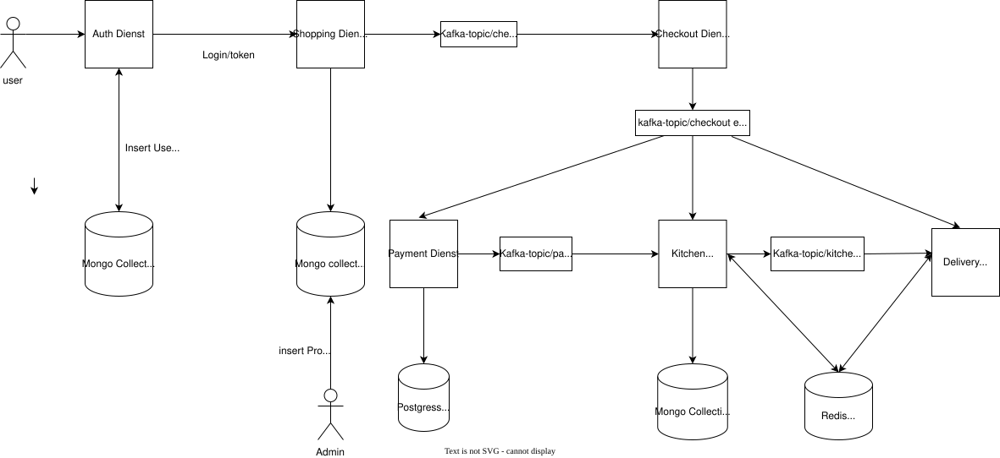

# Analytica Restaurant

Cloud-Native Restaurant Ordering System - Microservices-Architektur mit Event-Driven Design.

## Services

| Service              | Port | Beschreibung                         | Datenbank       | Entwickler |
| -------------------- | ---- | ------------------------------------ | --------------- | ---------- |
| **Frontend**         | 80   | Vue.js SPA mit Tailwind CSS          | -               |            |
| **Auth Service**     | 8081 | JWT Authentication & User Management | MongoDB         | Arnold     |
| **Shopping Service** | 8080 | Produktkatalog & Warenkorb           | MongoDB         | Arnold     |
| **Checkout Service** | 8082 | Order Processing & Event Publishing  | -               | Arnold     |
| **Payment Service**  | 8083 | Payment Processing & Simulation      | PostgreSQL      | Qendrim    |
| **Kitchen Service**  | 8084 | Order Preparation & Queue Management | MongoDB + Redis | Qendrim    |
| **Delivery Service** | 8085 | Delivery & Pickup Management         | Redis           | Qendrim    |

## Event Flow



## Tech Stack

**Backend:**

- Go 1.24
- Gin (HTTP Framework)
- Kafka (Event Messaging)
- Redis (Caching & Event Aggregation)
- PostgreSQL & MongoDB

**Frontend:**

- Vue.js 3
- Tailwind CSS
- Vite

**Infrastructure:**

- Docker & Docker Compose
- Kubernetes (Minikube)
- Helm Charts
- NGINX Ingress

## Projektstruktur

```
analytica-restaurant/
├── frontend/               # Vue.js Frontend
├── auth-service/           # Authentication & Users
├── shopping-service/       # Products & Cart
├── checkout-service/       # Order Creation
├── payment-service/        # Payment Processing
├── kitchen-service/        # Kitchen Management
├── delivery-service/       # Delivery & Pickup
├── helm/                   # Kubernetes Helm Charts
├── db/                     # Database Init Scripts
├── scripts/                # Utility Scripts
├── docker-compose.yml      # Local Development
└── .gitlab-ci.yml          # CI/CD Pipeline
```

## Lokale Entwicklung

### Voraussetzungen

- Docker & Docker Compose
- Go 1.24+
- Node.js 20+
- Minikube (optional)

### Mit Docker Compose

```bash
# Alle Services starten
docker-compose up -d

# Logs anzeigen
docker-compose logs -f

# Services stoppen
docker-compose down
```

### Testdaten generieren

Initial sind die Datenbanken (User, Produkte, etc...) noch leer.
Zum Testen kann das folgende Skript genutzt werden:

```bash
# Seed-Skript ausführen (erstellt Admin-User + Produkte)
./scripts/seed-products.sh
```

Das Skript:

1. Erstellt einen Admin-User (`admin@thi.de` / `admin123`)
2. Loggt sich ein und holt einen JWT-Token
3. Legt 10 Testprodukte an (Cloud-Native themed)

**Voraussetzungen:** \
`jq` muss installiert sein (`brew install jq` / `apt install jq`) \
Skript muss ausführbar sein (`chmod +x ./scripts/seed-products.sh`)

### Mit Minikube

**Voraussetzungen:**

- Minikube installiert
- Helm installiert
- VPN-Verbindung zur THI (für Harbor Registry)

```bash
# 1. Minikube starten
minikube start --memory=8192 --cpus=4

# 2. Ingress aktivieren
minikube addons enable ingress

# 3. Harbor Image Pull Secret erstellen
kubectl create secret docker-registry harbor-secret \
  --docker-server=case-projects.rz.fh-ingolstadt.de \
  --docker-username=DEIN_THI_USERNAME \
  --docker-password=DEIN_THI_PASSWORT

# 4. Helm Charts deployen
helm install analytica ./helm/analytica-restaurant

# 5. Warten bis alle Pods laufen
kubectl get pods -w

# 6. Tunnel starten (für Ingress, in separatem Terminal)
minikube tunnel
```

**Zugriff:**

- Frontend: `http://localhost`
- Kafka UI: `kubectl port-forward svc/kafka-ui 8090:8080` → `http://localhost:8090`

**Anmerkung:** Auch hier sind die Datenbanken initial leer und können mit [Testdaten](#testdaten-generieren) befüllt werden.

**Nützliche Befehle:**

```bash
# Pod Status
kubectl get pods

# Logs eines Services
kubectl logs -f deployment/auth-service

# Helm Upgrade nach Änderungen
helm upgrade analytica ./helm/analytica-restaurant

# Alles löschen und neu starten
helm uninstall analytica
minikube delete
```

## CI/CD

GitLab CI Pipeline mit:

- **Prepare Stage**: Installiert Dependencies
- **Build Stage**: Alle Go Services + Frontend
- **Test Stage**: Unit Tests
- **Push Stage**: Docker Images → Harbor Registry

```bash
# Pipeline manuell triggern
git push origin main
```

## Entwickelt für

THI - Cloud Native Development (CND)
