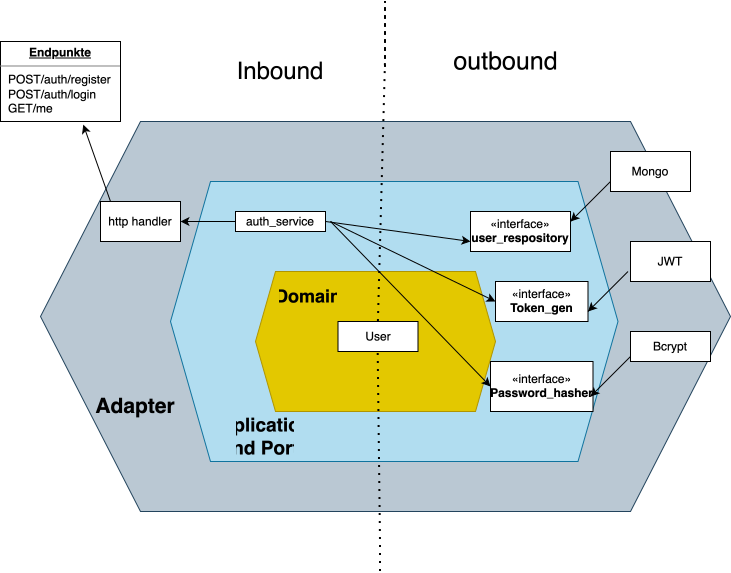

# Auth Service

Microservice für Authentication & Authorization im analytica-restaurant System.

## Architektur



Hexagonal Architecture (Ports & Adapters):

```
auth-service/
├── cmd/
│   └── main.go               # Application Entry Point
├── internal/
│   ├── adapters/
│   │   ├── ingoing/
│   │   │   └── rest/         # REST Handler, Middleware, Routes
│   │   └── outgoing/
│   │       ├── bcrypt/       # Password Hashing
│   │       ├── jwt/          # Token Generation
│   │       └── mongodb/      # User Repository
│   ├── application/
│   │   ├── ports/            # Interface Definitions
│   │   └── services/         # Business Logic
│   ├── config/
│   │   └── config.go         # Configuration
│   └── domain/
│       └── user.go           # User Entity
├── Dockerfile
├── go.mod
└── README.md
```

## Features

- REST API für User Authentication (Register, Login)
- JWT Token Generation & Validation
- Password Hashing mit Bcrypt
- MongoDB Persistence
- Protected Routes mit Auth Middleware

## API Endpoints

- `POST /auth/register` - Neuen Benutzer registrieren
- `POST /auth/login` - Benutzer einloggen (JWT Token)
- `GET /auth/me` - Aktuellen Benutzer abrufen (geschützt)
- `GET /health` - Health Check
- `POST /register` - Legacy Route (Rückwärtskompatibilität)
- `POST /login` - Legacy Route (Rückwärtskompatibilität)

## Auth Flow

```
User Registration/Login
         → Password Hashing (Bcrypt)
         → User Storage in MongoDB
         → JWT Token Generation
         → Token für geschützte Routen
```

## JWT Authentication

**Token Generation:**
- Algorithmus: HS256
- Payload: `user_id`, `email`, `role`
- Expiration: Konfigurierbar

**Protected Routes:**
- Header: `Authorization: Bearer <token>`
- Middleware validiert Token automatisch

## Environment Variables

- `MONGO_URI` - MongoDB Connection String (default: `mongodb://mongo:27017`)
- `MONGO_DB` - MongoDB Database Name (default: `auth-db`)
- `JWT_SECRET` - JWT Signing Secret
- `PORT` - HTTP Server Port (default: `8080`)

## Development

```bash
# Dependencies installieren
go mod download

# Service starten
go run cmd/main.go

# Build
go build -o auth-service cmd/main.go

# Docker Build
docker build -t auth-service .
```

## Dependencies

- MongoDB (Database)
- Gin (HTTP Framework)
- JWT-Go (Token Generation)
- Bcrypt (Password Hashing)
