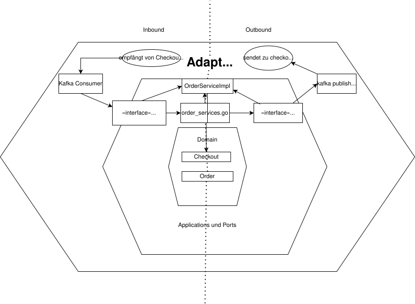

# Checkout Service

Microservice für Order Checkout Processing im analytica-restaurant System.

## Architektur



Hexagonal Architecture (Ports & Adapters):

```
checkout-service/
├── cmd/
│   └── main.go               # Application Entry Point
├── internal/
│   ├── adapters/
│   │   ├── ingoing/
│   │   │   └── kafka/        # Kafka Consumer
│   │   └── outgoing/
│   │       └── kafka/        # Kafka Publisher
│   ├── application/
│   │   ├── ports/            # Interface Definitions
│   │   └── services/         # Business Logic
│   ├── config/
│   │   └── config.go         # Configuration
│   └── domain/
│       └── models/           # Entities, DTOs
├── Dockerfile
├── go.mod
└── README.md
```

## Features

- Event-driven Checkout Processing über Kafka
- Order Creation aus Shopping Cart
- Event Publishing für Payment Service
- Stateless Processing (kein eigener State)

## API Endpoints

- Keine REST API (Event-driven only)
- Verarbeitet Events aus `checkout`

## Event Flow

```
shopping-events (CartCheckedout)
         → Order Creation
         → checkout-events (OrderCreated)
         → Payment Service empfängt dieses Event
```

## Kafka Events

**Consumed:**
- `checkout` - CartCheckedoutEvent (mit Cart Data)

**Produced:**
- `checkout-events` - OrderCreatedEvent (mit Order Data, Payment Info)

## Environment Variables

- `KAFKA_BROKERS` - Kafka Brokers (default: `kafka:9092`)
- `PORT` - HTTP Server Port (default: `8082`)

## Development

```bash
# Dependencies installieren
go mod download

# Service starten
go run cmd/main.go

# Build
go build -o checkout-service cmd/main.go

# Docker Build
docker build -t checkout-service .
```

## Dependencies

- Kafka (Event Messaging)
