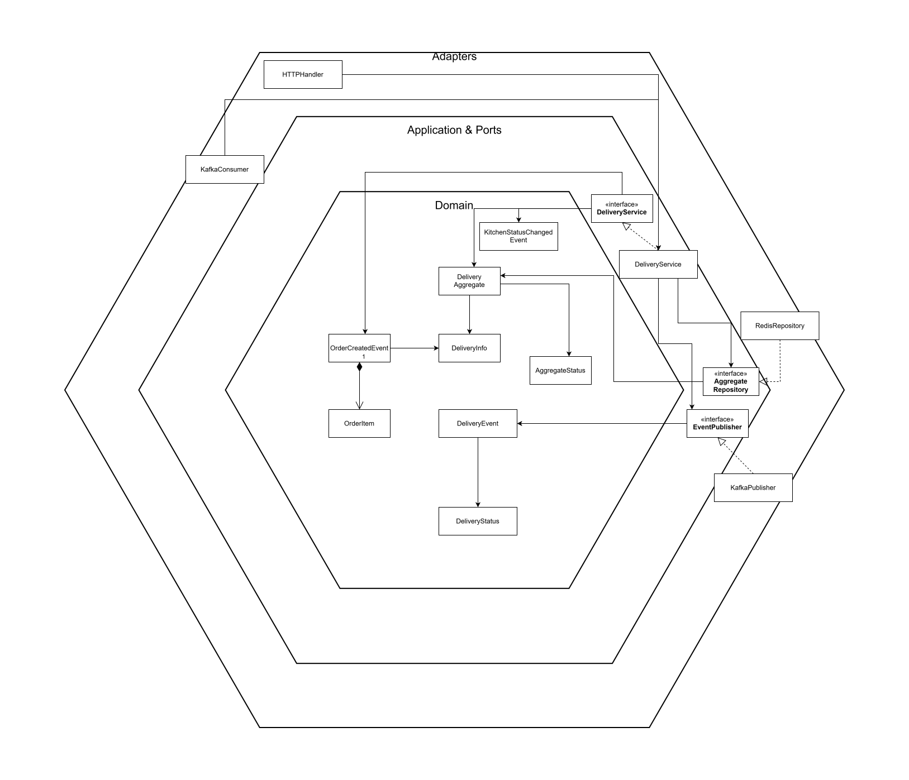

# Delivery Service

Event Aggregation Service für Delivery & Pickup Management im analytica-restaurant System.

## Architektur



Aufbau:

```
delivery-service/
├── src/
│   ├── adapter/
│   │   ├── ingoing/          # HTTP Handler, Kafka Consumer
│   │   └── outgoing/         # Redis Repository, Kafka Publisher
│   ├── application/
│   │   ├── ports/            # Interface Definitions
│   │   └── services/         # Business Logic & Event Aggregation
│   └── domain/               # Aggregates, DTOs, Events
├── Dockerfile
├── go.mod
└── README.md
```

## Features

- **Event Aggregation**: Kombiniert Order & Kitchen Events
- **Delivery Management**: Automatische Driver-Zuweisung
- **Pickup Orders**: Pickup-Ready Notifications
- **Driver Simulation**: Demo-Modus mit simulierten Updates
- **Redis State Management**: 24h TTL für Order Aggregates

## Event Flow

```
checkout-events (OrderCreated) + kitchen-events (OrderReady)
         → Event Aggregation in Redis
         → Delivery Assignment / Pickup Notification
         → delivery-events
```

## Aggregate States

| Status                | Beschreibung            |
| --------------------- | ----------------------- |
| `waiting_for_order`   | Warte auf Order Event   |
| `waiting_for_kitchen` | Warte auf Kitchen Ready |
| `ready_to_deliver`    | Bereit für Delivery     |
| `in_transit`          | Fahrer unterwegs        |
| `delivered`           | Zugestellt              |
| `pickup_ready`        | Bereit zur Abholung     |

## API Endpoints

- `GET /orders/{orderID}` - Order/Delivery Status abrufen
- `GET /health` - Health Check

## Kafka Events

**Consumed:**

- `checkout-events` - OrderCreatedEvent (mit DeliveryInfo)
- `kitchen-events` - KitchenStatusChangedEvent (status: "ready")

**Produced:**

- `delivery-events` - Unified DeliveryEvent mit Status:
  - `assigned` - Fahrer zugewiesen
  - `in_transit` - Fahrer unterwegs
  - `delivered` - Zugestellt
  - `pickup_ready` - Abholbereit (für Pickup Orders)

## Environment Variables

- `REDIS_ADDR` - Redis Address (default: `redis:6379`)
- `PORT` - HTTP Server Port (default: `8085`)

## Development

```bash
# Dependencies installieren
go mod download

# Service starten
go run src/main.go

# Build
go build -o delivery-service src/main.go

# Docker Build
docker build -t delivery-service .
```

## Dependencies

- Redis (Event Aggregation State)
- Kafka (Event Messaging)
