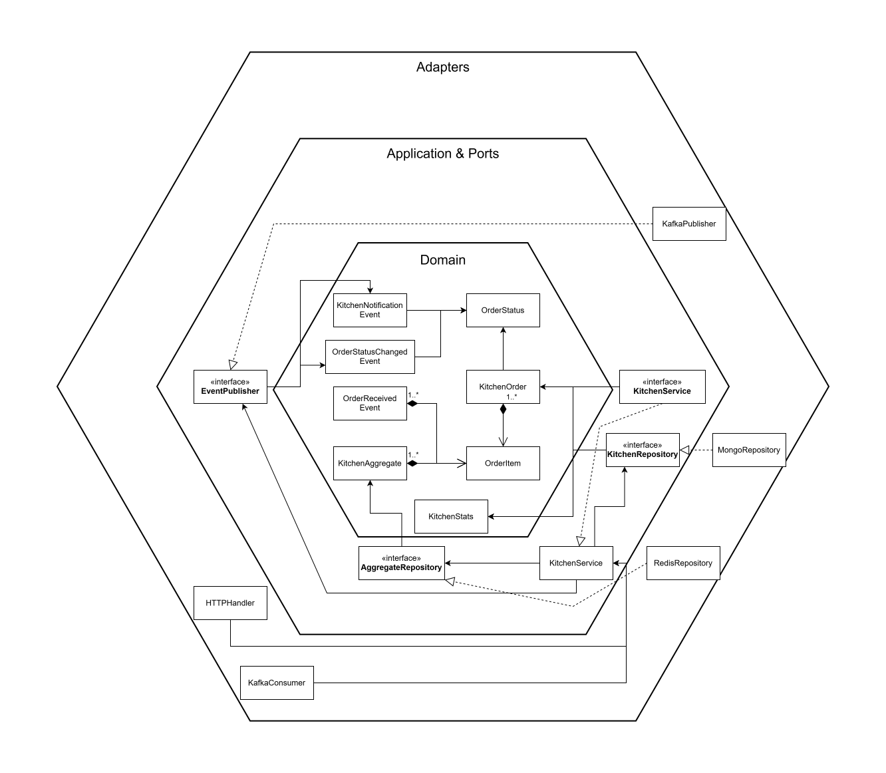

# Kitchen Service

Microservice für Kitchen Order Management im analytica-restaurant System.

## Architektur



Aufbau:

```
kitchen-service/
├── src/
│   ├── adapter/
│   │   ├── ingoing/          # HTTP Handler, Kafka Consumer
│   │   └── outgoing/         # MongoDB Repository, Redis Repository, Kafka Publisher
│   ├── application/
│   │   ├── ports/            # Interface Definitions
│   │   └── services/         # Business Logic & Event Aggregation
│   └── domain/               # Entities, Aggregates, Events
├── Dockerfile
├── go.mod
└── README.md
```

## Features

- **Event Aggregation**: Wartet auf Order + Payment bevor Zubereitung startet
- Order Queue Management
- Automated Order Processing (30s intervals)
- Real-time Order Status Updates
- Kitchen Statistics & Analytics
- Event-driven Communication via Kafka
- MongoDB Persistence (Orders) + Redis (Aggregation State)

## Order Status Flow

```
received → preparing → ready → picked_up_by_driver
                    ↓
                cancelled
```

## API Endpoints

- `GET /kitchen/orders` - Alle Orders abrufen
- `GET /kitchen/orders/:orderID` - Order by ID
- `POST /kitchen/orders/:orderID/start` - Zubereitung starten
- `POST /kitchen/orders/:orderID/complete` - Order fertig melden
- `POST /kitchen/orders/:orderID/pickup` - Fahrer Abholung markieren
- `POST /kitchen/orders/:orderID/cancel` - Order stornieren
- `GET /kitchen/stats` - Kitchen Statistics
- `POST /kitchen/process-queue` - Queue manuell verarbeiten
- `GET /kitchen/dashboard` - Kitchen Dashboard (deprecated)
- `GET /health` - Health Check

## Event Aggregation

Die Küche startet die Zubereitung erst wenn beide Events eingegangen sind:

```
checkout-events (OrderCreated) + payment-events (PaymentSucceeded)
         → Event Aggregation in Redis
         → Küche startet Zubereitung
```

## Kafka Events

**Consumed:**

- `checkout-events` - OrderCreatedEvent
- `payment-events` - PaymentSucceededEvent
- `kitchen-events` - Order Confirmations

**Produced:**

- `kitchen-events` - OrderStatusChangedEvent, KitchenNotificationEvent

## Environment Variables

- `MONGO_URI` - MongoDB Connection String (default: `mongodb://localhost:27017`)
- `REDIS_ADDR` - Redis Address (default: `redis:6379`)
- `KAFKA_BROKER` - Kafka Broker Address (default: `localhost:9092`)
- `PORT` - HTTP Server Port (default: `8084`)

## Development

```bash
# Dependencies installieren
go mod download

# Service starten
go run src/main.go

# Build
go build -o kitchen-service src/main.go

# Docker Build
docker build -t kitchen-service .
```

## Dependencies

- MongoDB (Order Persistence)
- Redis (Event Aggregation State)
- Kafka (Event Messaging)
