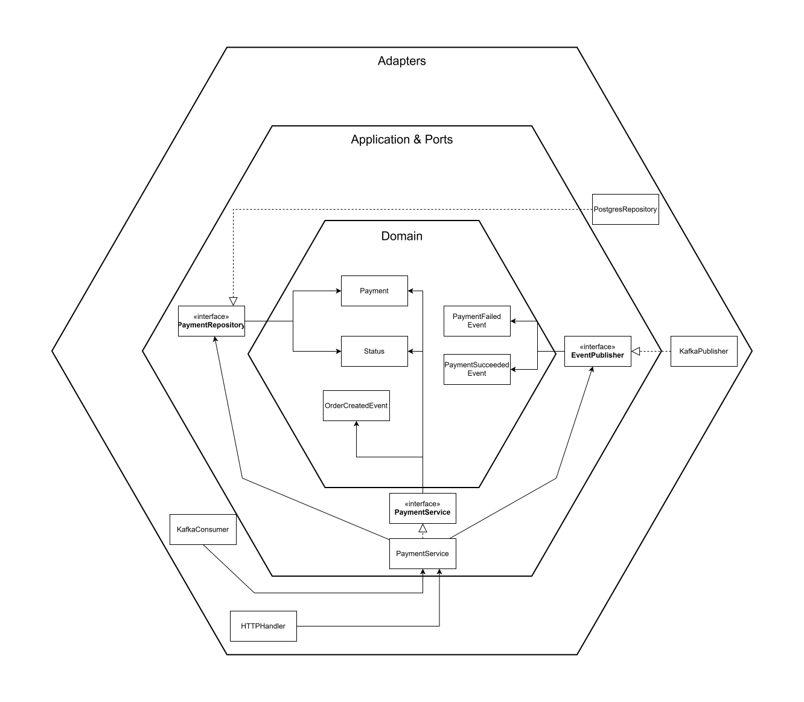

# Payment Service

Microservice für Payment Processing im analytica-restaurant System.

## Architektur



Aufbau:

```
payment-service/
├── src/
│   ├── adapter/
│   │   ├── ingoing/          # HTTP Handler, Kafka Consumer
│   │   └── outgoing/         # Postgres Repository, Kafka Publisher
│   ├── application/
│   │   ├── ports/            # Interface Definitions
│   │   └── services/         # Business Logic
│   └── domain/               # Entities, DTOs, Events
├── Dockerfile
├── go.mod
└── README.md
```

## Features

- REST API für Payment Management (CRUD)
- Event-driven Processing über Kafka
- PostgreSQL Persistence
- Payment Provider Simulation (Stripe, PayPal, Lastschrift)

## API Endpoints

- `GET /payments` - Alle Payments abrufen
- `GET /payments/:id` - Payment by ID
- `POST /payments` - Neues Payment erstellen
- `PUT /payments/:id/status` - Payment Status updaten
- `DELETE /payments/:id` - Payment löschen
- `GET /payments/search?status=<status>` - Payments nach Status filtern

## Event Flow

```
checkout-events (OrderCreated)
         → Payment Processing (Simulation)
         → payment-events (PaymentSucceeded/PaymentFailed)
         → Kitchen Service wartet auf dieses Event
```

## Kafka Events

**Consumed:**

- `checkout-events` - OrderCreatedEvent (mit Payment Provider Info)

**Produced:**

- `payment-events` - PaymentSucceededEvent / PaymentFailedEvent

## Environment Variables

- `DATABASE_URL` - PostgreSQL Connection String (default: `host=postgres user=paymentuser password=paymentpass dbname=paymentdb port=5432 sslmode=disable`)
- `PORT` - HTTP Server Port (default: `8083`)

## Development

```bash
# Dependencies installieren
go mod download

# Service starten
go run src/main.go

# Build
go build -o payment-service src/main.go

# Docker Build
docker build -t payment-service .
```

## Dependencies

- PostgreSQL (Database)
- Kafka (Event Messaging)
