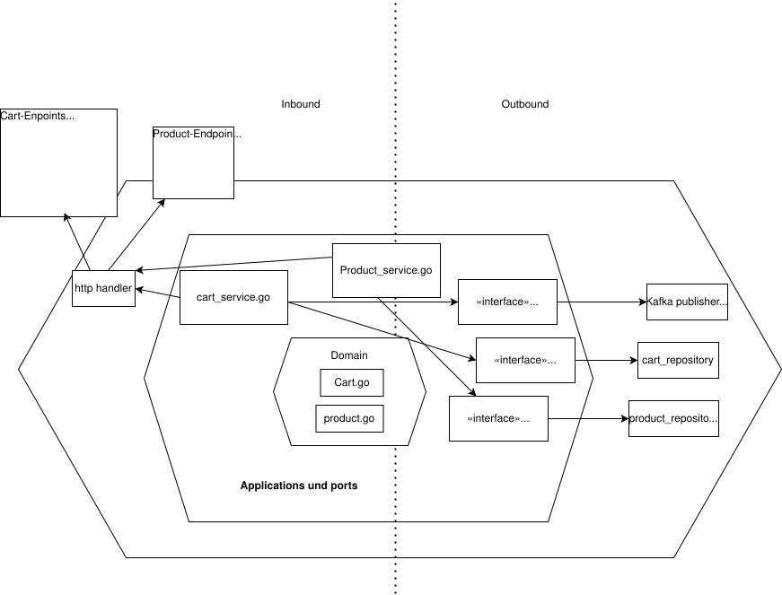

# Shopping Service

Microservice für Shopping Cart Management im analytica-restaurant System.

## Architektur



Hexagonal Architecture (Ports & Adapters):

```
shopping-service/
├── cmd/
│   └── main.go               # Application Entry Point
├── internal/
│   ├── adapters/
│   │   ├── ingoing/          # REST Handler
│   │   └── outgoing/         # MongoDB Repository, Kafka Publisher
│   ├── application/
│   │   ├── ports/            # Interface Definitions
│   │   └── services/         # Business Logic
│   ├── config/
│   │   └── config.go         # Configuration
│   └── domain/
│       └── models/           # Entities, DTOs
├── Dockerfile
├── go.mod
└── README.md
```

## Features

- REST API für Cart Management (CRUD)
- Event-driven Processing über Kafka
- MongoDB Persistence
- Checkout Integration mit Checkout Service

## API Endpoints

- `GET /carts` - Alle Carts abrufen
- `GET /carts/:id` - Cart by ID
- `POST /carts` - Neuen Cart erstellen
- `POST /carts/:id/items` - Item zum Cart hinzufügen
- `PUT /carts/:id/items/:itemId` - Item im Cart aktualisieren
- `DELETE /carts/:id/items/:itemId` - Item aus Cart entfernen
- `POST /carts/:id/checkout` - Cart checkout
- `DELETE /carts/:id` - Cart löschen

## Event Flow

```
User Actions (Add/Remove Items)
         → Cart Management in MongoDB
         → shopping-events (CartUpdated)
         → Checkout Service empfängt Cart Data
```

## Kafka Events

**Consumed:**
- Keine (Shopping ist Event Producer)

**Produced:**
- `shopping-events` - CartCreatedEvent / CartUpdatedEvent / CartCheckedoutEvent

## Environment Variables

- `MONGO_URI` - MongoDB Connection String (default: `mongodb://mongo:27017`)
- `MONGO_DB` - MongoDB Database Name (default: `shopping-db`)
- `PORT` - HTTP Server Port (default: `8081`)
- `KAFKA_BROKERS` - Kafka Brokers (default: `kafka:9092`)

## Development

```bash
# Dependencies installieren
go mod download

# Service starten
go run cmd/main.go

# Build
go build -o shopping-service cmd/main.go

# Docker Build
docker build -t shopping-service .
```

## Dependencies

- MongoDB (Database)
- Kafka (Event Messaging)
